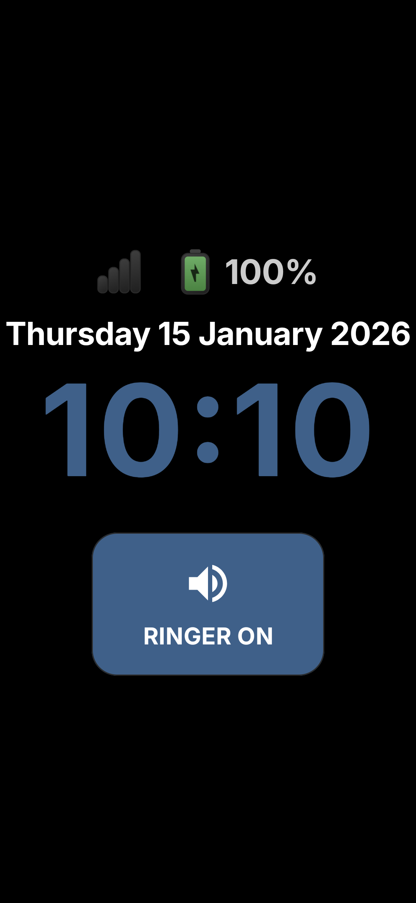
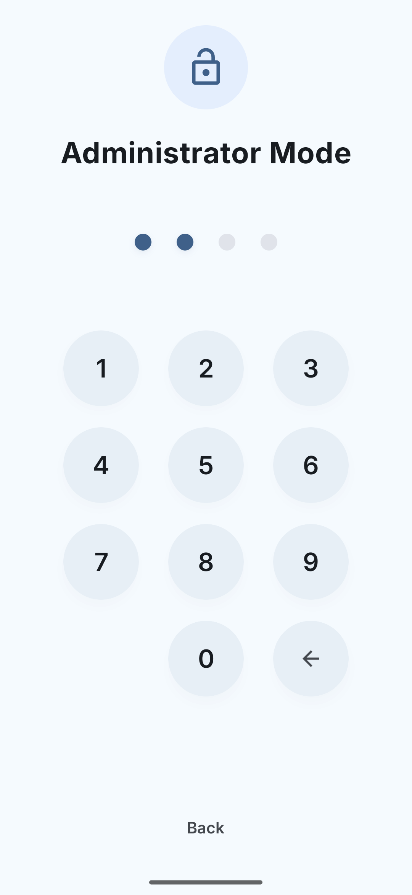
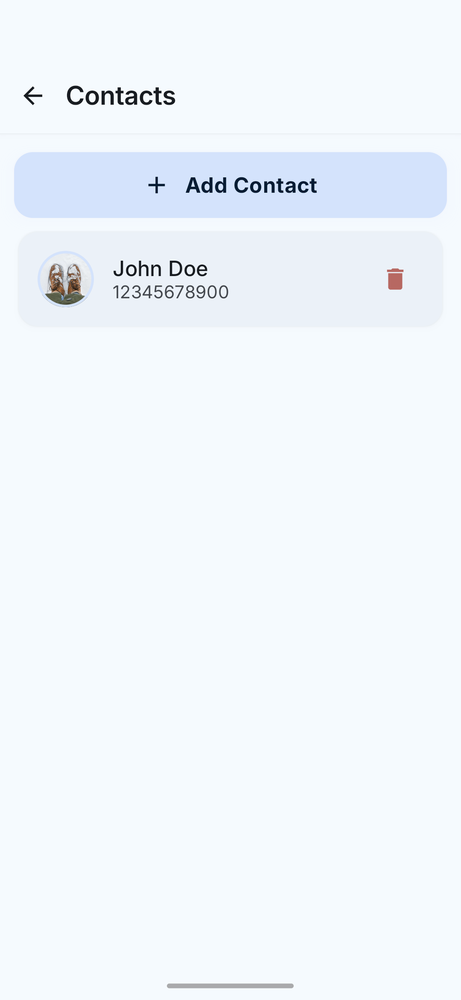
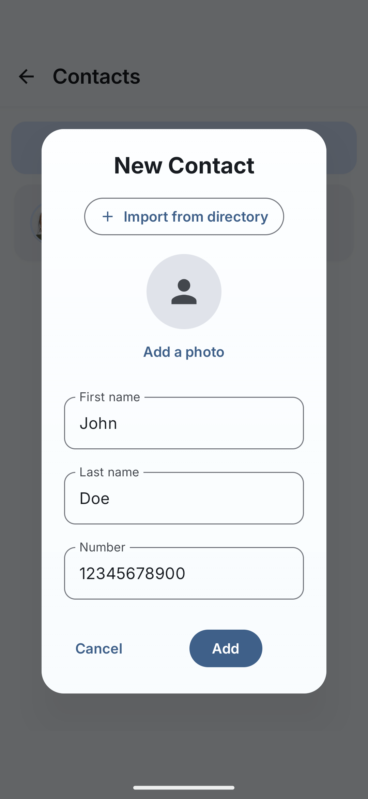
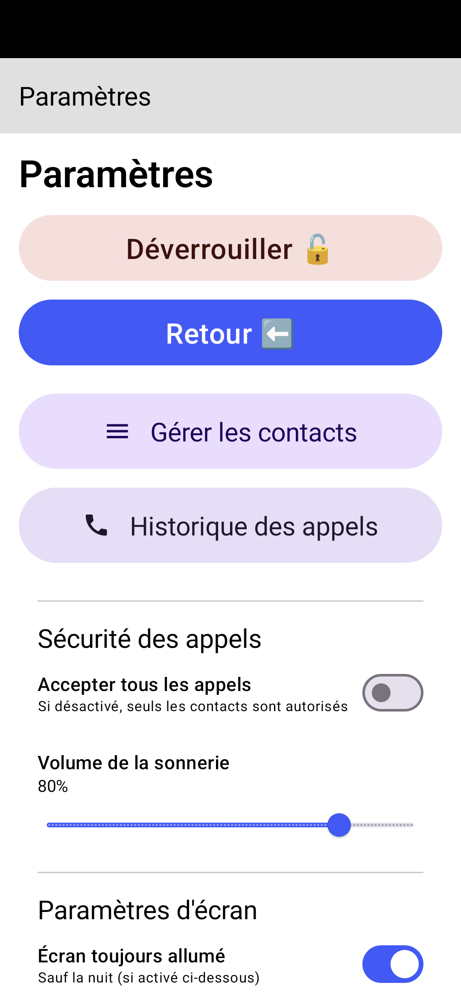
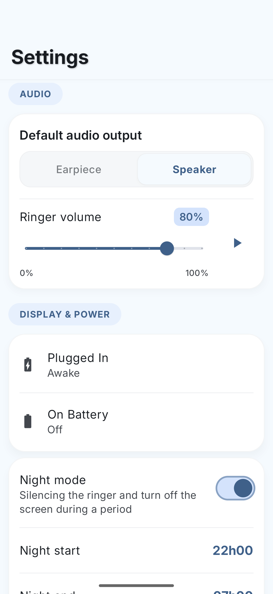
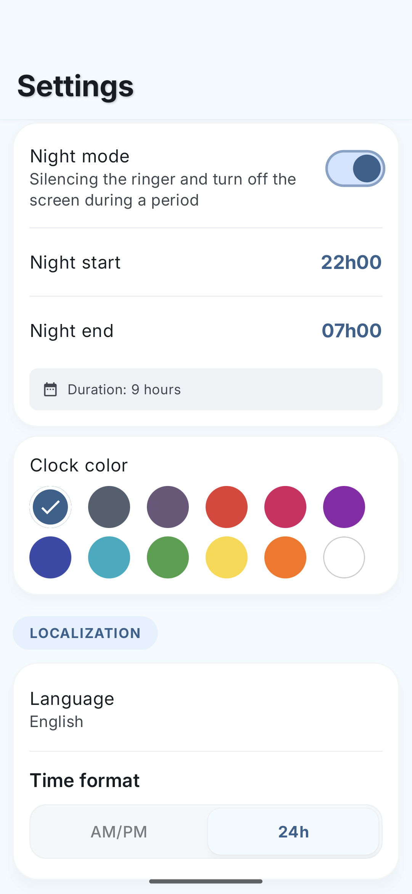
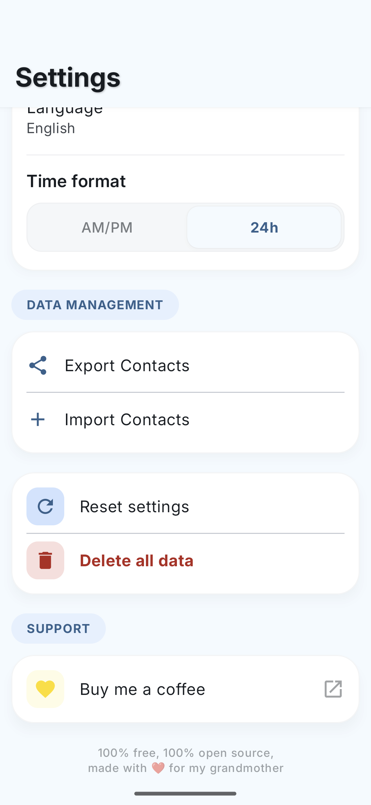
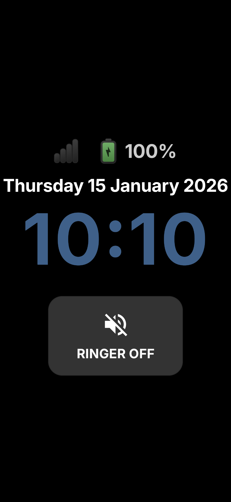
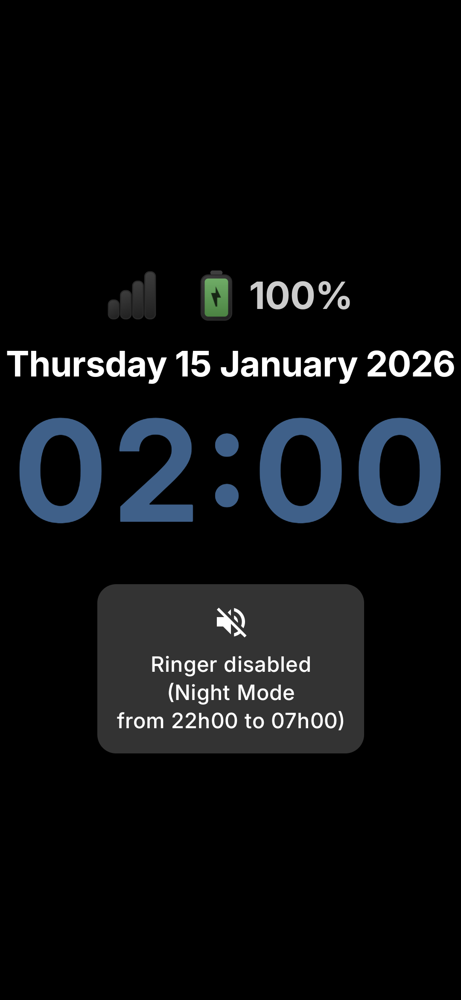

# Incoming Call Only Launcher – Launcher Android Minimaliste et Sécurisé

[](README.md)
[](README.fr.md)
[](LICENSE)
[](#prérequis)
[](https://github.com/lcarne/call-only-launcher/releases)


**Incoming Call Only Launcher** est un launcher Android (ou lanceur Android) minimaliste et open-source conçu pour les personnes âgées et les utilisateurs vulnérables. Il transforme un appareil Android en **téléphone en réception uniquement**, permettant les appels entrants exclusivement de contacts de confiance, tout en désactivant complètement les appels sortants et toutes les fonctionnalités système non essentielles.

> **Objectif :** Offrir une expérience calme, sûre et sans confusion, tout en donnant aux soignants, aidants et aux membres de la famille un contrôle total sur l'appareil.

**Conçu pour :** Personnes âgées • Établissements de soins • Hôpitaux • Soignants • Personnes atteintes de troubles cognitifs • Appareils kiosque

---

## 📱 Télécharger depuis Play Store

<a href="https://play.google.com/store/apps/details?id=com.incomingcallonly.launcher" target="_blank">
  
</a>

Ou téléchargez l'APK le plus récent depuis [GitHub Releases](https://github.com/lcarne/call-only-launcher/releases)

---

## Table des matières

- [Objectif](#objectif)
- [Fonctionnalités principales](#fonctionnalités-principales)
- [Prérequis](#prérequis)
- [Installation et configuration](#installation-et-configuration)
- [Configuration initiale](#configuration-initiale-onboarding)
- [Accès administrateur](#accès-administrateur-comment-ouvrir-lécran-administrateur)
- [Stack technique](#stack-technique)
- [Captures d'écran](#captures-décran)
- [Confidentialité et données](#confidentialité-et-données)
- [Contribution](#contribution)
- [Licence](#licence)
- [Avis juridique](#avis-juridique)

---

## Objectif

Incoming Call Only Launcher verrouille l'utilisateur dans une **interface à usage unique** axée sur la sécurité et la clarté.

L'utilisateur peut :

- Voir la date et l'heure actuelles avec un **affichage grand et à fort contraste**
- Recevoir **des appels entrants uniquement** d'une liste organisée de contacts de confiance

Tout le reste est intentionnellement caché ou restreint :

- Pas d'appels sortants
- Pas de notifications
- Pas d'applications de messagerie
- Pas de paramètres système ou de navigation
- Pas d'interactions accidentelles

Cette conception minimise la confusion et prévient les abus.

**Les cas d'usage typiques incluent:**

- Les utilisateurs âgés qui ne doivent pas effectuer d'appels accidentels ou d'urgence
- Les personnes atteintes de la maladie d'Alzheimer ou de troubles cognitifs
- Les patients dans les établissements de soins ou les hôpitaux
- Les enfants ou les personnes vulnérables utilisant un appareil dédié
- Les situations où les soignants ont besoin d'un contrôle total sur qui peut appeler l'appareil

---

## Ce que cette application est (et n'est pas)

**Incoming Call Only Launcher est intentionnellement limité par conception.**

✔ C'est :

- Une interface téléphonique en réception uniquement
- Un launcher Android axé sur la sécurité
- Un environnement contrôlé pour les soignants

✖ Ce n'est PAS :

- Une application téléphonique standard
- Un composeur
- Une application de messagerie
- Un launcher polyvalent

---

## Fonctionnalités principales

- **Interface axée sur les personnes âgées**  
  Grande horloge numérique, date complète et thème à fort contraste. Écrans d'appel redessinés avec un texte très grand, des boutons d'action vibrants et un style rassurant.

- **Routage audio intelligent**  
  Les appels entrants commencent par **le haut-parleur par défaut**, aidant les utilisateurs ayant des problèmes d'audition ou de dextérité. Basculez entre le haut-parleur et l'écouteur à l'aide de grands boutons clairs.

- **Gestion sécurisée des appels**  
  - Les appels entrants sonnent uniquement pour les contacts.
  - Les appelants inconnus sont **automatiquement silencieux ou rejetés**.
  - **Sécurité 2-Tap**: Les actions de raccrocher et refuser nécessitent deux appuis pour éviter une fermeture accidentelle d'appel.

- **Modes kiosque et épinglage**
  - **Épinglage d'écran**: Verrouillez facilement l'application à l'écran depuis le menu Administrateur (aucun ADB requis).
  - **Propriétaire d'appareil**: Pour un verrouillage complet (barre d'état désactivée, navigation bloquée), définissez comme propriétaire d'appareil via ADB.

- **Interface administrateur protégée**  
  Un écran administrateur caché permet aux soignants de gérer les contacts et le comportement de l'appareil sans risque d'accès accidentel.

- **Accès PIN simple**  
  L'accès administrateur est protégé par un code PIN (par défaut: `1234`) pour un accès rapide et contrôlé au soignant.

- **Historique des appels**
  Consultez un journal détaillé des appels entrants, manqués et rejetés avec durée et horodatage.

- **Sauvegarde et restauration locales**
  Exportez facilement votre liste de contacts vers un fichier JSON et restaurez-la sur un autre appareil ou après une réinitialisation.

---

## Confidentialité et données

Incoming Call Only Launcher ne collecte, n'enregistre ni ne transmet **aucune donnée personnelle**.

- Pas d'analytique
- Pas de suivi
- Pas de services cloud
- Pas d'intégrations tierces

Tous les contacts, paramètres et historiques d'appels sont stockés **localement sur l'appareil uniquement**.

---

## Stack technique

- **Langage**: Kotlin  
- **Interface utilisateur**: Jetpack Compose (Material 3)  
- **Typographie**: [Famille de polices Inter](https://rsms.me/inter/) (Licence SIL Open Font)  
- **Architecture**: MVVM + Hilt  
- **Stockage**: Base de données Room  
- **Sécurité**:
  - `DevicePolicyManager` (Propriétaire d'appareil / Mode kiosque)
  - `CallScreeningService` (Filtrage des appels entrants)

Voir [ATTRIBUTIONS.md](ATTRIBUTIONS.md) pour les licences tierces.

---

## Captures d'écran

> Interface propre et à fort contraste conçue pour les utilisateurs âgés et vulnérables.

### Accueil et appel entrant

<table>
  <tr>
    <td align="center">
      <br/>
      <strong>Écran d'accueil</strong>
    </td>
    <td align="center">
      <br/>
      <strong>Appel entrant</strong>
    </td>
    <td align="center">
      <br/>
      <strong>Appel en cours</strong>
    </td>
  </tr>
</table>

---

### Administrateur et gestion des contacts

<table>
  <tr>
    <td align="center">
      <br/>
      <strong>Administrateur / Entrée PIN</strong>
    </td>
    <td align="center">
      <br/>
      <strong>Gestion des contacts</strong>
    </td>
    <td align="center">
      <br/>
      <strong>Ajouter un contact</strong>
    </td>
  </tr>
</table>

---

### Paramètres

<table>
  <tr>
    <td align="center">
      <br/>
      <strong>Déverrouiller, contenu et système</strong>
    </td>
    <td align="center">
      <br/>
      <strong>Audio, affichage et alimentation</strong>
    </td> 
    <td align="center">
      <br/>
      <strong>Affichage et localisation</strong>
    </td>
    <td align="center">
      <br/>
      <strong>Gestion des données et support</strong>
    </td>
  </tr>
</table>

---

### États supplémentaires

<table>
  <tr>
    <td align="center">
      <br/>
      <strong>Sonnerie désactivée</strong>
    </td>
    <td align="center">
      <br/>
      <strong>Mode nuit</strong>
    </td>
    <td align="center">
      <br/>
      <strong>Mode assombri</strong>
    </td>
  </tr>
</table>

---

## Prérequis

- **Android 6.0** (niveau API 23) ou supérieur
- Minimum **50 MB** d'espace de stockage libre
- Ligne téléphonique active avec capacité d'appel entrant
- Pour le mode propriétaire d'appareil: Débogage USB activé et accès ADB

---

## Installation et configuration

### Option 1 – Télécharger depuis Google Play Store (Recommandé)

Le moyen le plus facile d'installer est via le Play Store officiel:

📲 [Disponible sur Google Play Store](https://play.google.com/store/apps/details?id=com.incomingcallonly.launcher)

Cela garantit que vous disposez toujours de la dernière version avec des mises à jour automatiques.

### Option 2 – Télécharger l'APK pré-compilé

Vous pouvez télécharger un APK prêt à installer à partir de GitHub Releases:

➡️ [GitHub Releases](https://github.com/lcarne/call-only-launcher/releases)

Chaque version inclut :

- Un APK signé
- Notes de version

**Étapes:**

1. Téléchargez le fichier `.apk` à partir de la page Releases.
2. Copiez-le sur l'appareil Android cible.
3. Autorisez l'installation à partir de sources inconnues si vous y êtes invité.
4. Installez l'APK.

### Option 3 – Construire à partir du code source

Pour les développeurs qui souhaitent construire à partir du code source:

1. Clonez ce référentiel :

   ```bash
   git clone https://github.com/lcarne/call-only-launcher.git
   cd call-only-launcher
   ```

2. Ouvrez le projet dans Android Studio.
3. Compilez et installez l'APK sur l'appareil cible :

   ```bash
   ./gradlew assembleDebug
   ```

---

## Configuration initiale (Onboarding)

Au premier lancement, un **flux d'intégration** vous guidera à travers :

- Demande d'accès à la localisation (utilisée pour afficher la qualité du réseau)
- Configuration de l'application téléphonique par défaut
- Configuration du launcher par défaut
- Activation du verrouillage d'application pour la sécurité

---

## Accès administrateur (Comment ouvrir l'écran administrateur)

L'interface administrateur est intentionnellement cachée pour éviter un accès accidentel par l'utilisateur final.

- Sur l'écran d'accueil, **appuyez rapidement 15 fois sur la zone date/heure** pour ouvrir le point d'entrée administrateur.
- Entrez le code PIN par défaut: `1234` (peut être modifié dans les paramètres d'administration)

### Depuis l'interface administrateur, vous pouvez :

- **Gérer les contacts**: Ajouter, modifier ou supprimer des contacts de confiance.
- **Afficher l'historique des appels**: Vérifier l'activité récente, y compris les appels bloqués.
- **Gestion des données**:
  - **Exporter/Importer les contacts**: Sauvegardez votre liste de confiance dans un fichier JSON.
  - **Réinitialiser les données**: Effacer l'historique des appels ou réinitialiser les paramètres de l'application.
- **Écran et alimentation**: Configurez le comportement en fonction de l'état d'alimentation (branché vs sur batterie):
  - **Arrêt**: Délai d'expiration standard d'Android.
  - **Assombri**: L'écran reste allumé avec une luminosité réduite, affichant uniquement l'horloge.
  - **Réveillé**: L'écran reste allumé à luminosité normale.
- **Personnalisation**: Configurez le mode nuit, la couleur de l'horloge, le volume de la sonnerie.
- **Contrôle du système**:
  - **Épingler l'application**: Activez l'épinglage d'écran Android pour verrouiller l'utilisateur dans l'application (aucun ADB requis).
  - **Dépingler / Déverrouiller**: Quittez temporairement le mode restreint.
  - **Définir comme launcher par défaut**: Re-demandez de définir en tant qu'application d'accueil si nécessaire.

### Activer le vrai mode kiosque (Propriétaire d'appareil)

Pour un verrouillage complet (désactiver la barre d'état, la navigation, les gestes système), définissez l'application comme **propriétaire d'appareil**.

⚠️ **Avertissement**  
Cette action est irréversible sans accès ADB.

#### Conditions préalables

- Supprimez les comptes Google de l'appareil (recommandé)
- Activez **le débogage USB** dans les options pour développeurs

#### Commande ADB

```bash
adb shell dpm set-device-owner com.incomingcallonly.launcher/.receivers.IncomingCallOnlyAdminReceiver
```

Si réussi, le launcher sera épinglé et la barre d'état/navigation sera désactivée selon la politique d'appareil.

### Déverrouillage d'urgence / Suppression du propriétaire d'appareil

Si vous ne pouvez pas accéder au bouton de déverrouillage administrateur, supprimez le propriétaire d'appareil via ADB:

```bash
adb shell dpm remove-active-admin com.incomingcallonly.launcher/.receivers.IncomingCallOnlyAdminReceiver
```

---

## Notes et détails d'implémentation

- Le récepteur d'administration est `com.incomingcallonly.launcher.receivers.IncomingCallOnlyAdminReceiver` et est déclaré dans le manifeste avec la permission `BIND_DEVICE_ADMIN`.
- Le comportement du kiosque (verrouillage des packages de tâche, désactivation de la barre d'état) est contrôlé via `DevicePolicyManager` dans `MainActivity`.

## Contribution

Les contributions et corrections sont bienvenues. Veuillez ouvrir des problèmes ou des demandes de fusion pour les demandes de fonctionnalités, les correctifs ou les mises à jour de documentation.

## Licence

Ce projet est sous licence MIT, consultez le fichier [LICENSE](LICENSE).

---

## Avis juridique

### Marques déposées et logos

Ce projet fait référence et inclut des liens vers le **Google Play Store**. Le logo et la marque Google Play sont des marques déposées de Google LLC.

- Nous ne sommes **pas affiliés** à Google LLC.
- Le badge et le logo du Google Play Store sont utilisés en vertu d'une utilisation équitable à titre informatif uniquement pour diriger les utilisateurs vers notre canal officiel de distribution d'applications.
- Cette application est distribuée sous la licence MIT et nous nous conformons à toutes les politiques et directives du Play Store.

### Attribution

- [Famille de polices Inter](https://rsms.me/inter/) (Licence SIL Open Font)
- [Material You](https://material.io/you)

Pour une liste complète des licences tierces et des attributions, veuillez consulter [ATTRIBUTIONS.md](ATTRIBUTIONS.md).

---

*100% gratuit, 100% open source, créé avec ❤️ pour ma grand-mère*
